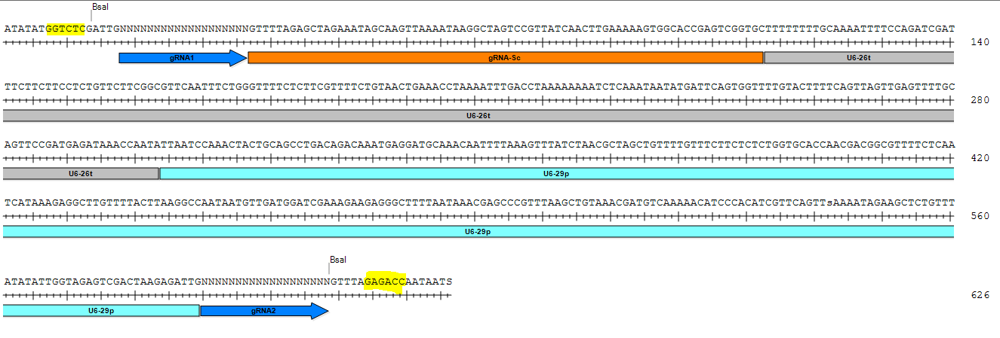
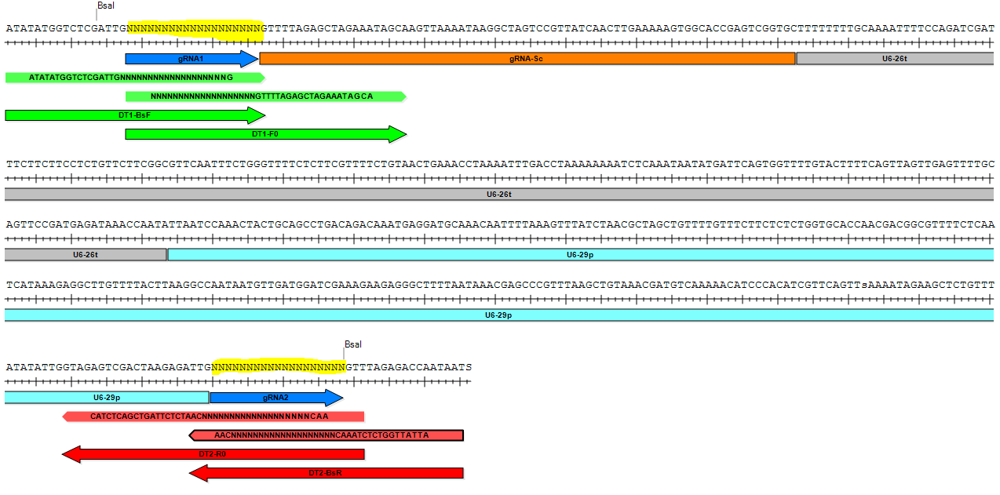
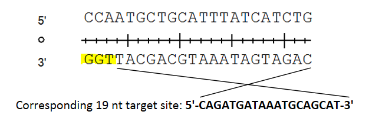

# Introduction

## CRISPR/Cas system


## single guide RNA

A single guide RNA (sgRNA) is an engineered RNA molecule containing 2 elements:

* a CRISPR RNA (crRNA) which contains the target site (also called **spacer**) of the genome and is usually 15-20 bp long 
* a trans-activating crRNA (tracrRNA), also called **scaffold sequence**, which binds to the Cas9 nuclease

In nature, these 2 elements form 2 separate RNA molecules which hybridize to ensure Cas9 activity at the target site specified by the crRNA. They were merged into one molecule called sgRNA to facilitate cloning. Hairpin structures within the sgRNA mimics the crRNA-tracrRNA complex enabling the binding of Cas9.

**Note**: the original target sequence in the invading phage which is incorporated into the repeat-spacer array (also called CRISPR array) in bacteria is called the **protospacer**. It becomes the **spacer** once in the repeat-spacer array and becomes the crRNA when transcribed. **Protospacer adjacent motif** (PAM) defines the 3-nt motif adjacent (in 5') to the original **protospacer**. Since the term **target sequence/site** sounds more explicit than **spacer** to define the 19-20 nt sequence which matches the region of the genome to be targeted, we will stick to the **target sequence/site** across the text.


# Material required

## Plasmids

The construct is split into one module vector set (pCBC-DT1T2) containing two single guide RNAs (sgRNAs) and a binary vector based on pCAMBIA (pHEE401E) containing additional sequences ensuring proper expression of the 2 sgRNAs and transformation into Arabidopsis. The cloning happens in 2 steps:

1. First a PCR on pCBC-DT1T2 allows to add the proper target sequences on the gRNA and the *BsaI* restriction sites on pCBC-DT1T2 
2. Secondly, a restriction-ligation step is performed to incorporate a part of pCBC-DT1T2 into pHEE401E, removing in the meantime its spectinomycin (SpR) resistance cassette of the latter [Xing et al 2014](https://bmcplantbiol.biomedcentral.com/articles/10.1186/s12870-014-0327-y).

*Cas9* expression is driven by the promoter of the egg cell-specific *EC1.1* ([AT1G76750](https://www.arabidopsis.org/servlets/TairObject?id=29908&type=locus)) gene and the enhancer  *EC1.2* gene ([AT2G21740](https://www.arabidopsis.org/servlets/TairObject?accession=locus:2052536)). This tissue-specific expression of *Cas9* allows to obtain T1 homozygous or biallelic plants instead of mosaic plants. The terminator of the *Pisum sativum rbcS E9* gene was tested according to previous observation ([Sarrion-Perdigones et al 2013](http://www.plantphysiol.org/content/162/3/1618.short)) and found more efficient than coupled with a NOS terminator. See reference [Wang et al. 2015](https://genomebiology.biomedcentral.com/articles/10.1186/s13059-015-0715-0).


### Module vector pCBC-DT1T2

More information on https://www.addgene.org/50590/

Plasmid available in genebank format in [plasmids/pCBC_DT1T2.gbk](plasmids/pCBC_DT1T2.gbk). This file can be open with the free software SnapGene viewer (download [here](https://www.snapgene.com/snapgene-viewer/)).

This vector contains 2 sgRNAs (Ns). More target sequences can be added by adding primers with specific overhanging sequence for Golden Gate assembly. See more details about Golden Gate assembly on [NEB website](https://international.neb.com/applications/cloning-and-synthetic-biology/dna-assembly-and-cloning/golden-gate-assembly).

The main principle to understand GoldenGate cloning is that a type IIS restriction enzyme such as *BsaI*, used here, is able to cut besides its actual recognition site, allowing to create non-palindromic overhangs which allow directional cloning.

*BsaI* restriction site:

```
5'...GGTCTC(N)1...3'
3'...CCAGAG(N)5...5'
```

The enzyme cuts 1 nucleotide directly upstream of the recognition site on the + strand but 5 nucleotides upstream on the - strand (highlighted in yellow in figure below). The 5 nucleotides overhang can be chosen and included in any construct to allow ligation. T4 ligase is used to ligate the corresponding cohesive ends (it is also able to ligate blunt ends but with much lower efficiency).


 
*Part of the plasmid pCBC-DT1T2 containing the elements which will be transfered into pHEE401E during the GoldenGate cloning. BsaI restriction sites are highlighted in yellow.*

Note that the vector pCBC-DT1T2 does not contain the promoter of the first sgRNA and the second sgRNA contains neither its scaffold sequence nor its terminator. These sequences are actually in the pHEE401E binary vector and will be integrated in place after the digestion with *BsaI* enzyme and the ligation (GoldenGate cloning).


### pHEE401E binary vector

pHEE401E is based on pCambia backbone for Agrobacterium-mediated transformation. It contains the complementary parts of the pCBC-DT1T2 which ensures the proper expression of the 2 sgRNAs plus other features needed for Agrobacterium transformation and selection.

More information on https://www.addgene.org/71287/ 

Plasmid available in genebank format in [plasmids/pHEE401E.gbk](plasmids/pHEE401E.gbk). This file can be open with the free software SnapGene viewer (download [here](https://www.snapgene.com/snapgene-viewer/)).


# Design of sgRNAs

## Cloning strategy

The vector pCBC-DT1T2 contain 2 sgRNAs, therefore 2 target sequences. They can target 2 different regions of the genome or target the same gene for instance.

To generate 2 sgRNAs with each their target site (gRNA1 and gRNA2 indicated by blue arrows and highlighted in yellow in image below), 4 primers need to be designed. Two primers for the target site 1 and 2 primers for the target size 2 (see image below):

Primers for the first sgRNA (green on picture below)

* DT1-BsF
* DT1-F0

Primers for the second sgRNA (red on picture below)

* DT2-BsR
* DT2-R0

These target sequences should be 19-20 bp long be adjacent to a 5'-NGG-3' site (N being any nucleotide), which is not in the primer sequence (note that 20 bp also works since the theoretical range for SpCas9 guide sequence is 15-20 bp). This NGG site is called the protospacer adjacent motif (PAM) and is specific to certain Cas9 nucleases, including the most used: SpCas9, which is produced by the bacterium *Streptococcus pyogenes* (Cas9 nucleases from other species may have a different PAM). SpCas9 enzymes cuts 3 bp upstream of the PAM motif (always within the target sequence). The PAM should always be originally located at the 5' end of the sgRNA target sequence. The script [find_pam.py](find_pam.py) and [primer_modifier.py](primer_modifier.py) have use per default 20 bp as protospacer lenght (can be modified in the script).

For instance, in the 22-mer `TCGAGAGAGAGCGTATTTCGGG`, the 3-mer `GGG` is the PAM motif located 3' of the sequence and the cut will therefore take place here: `TCGAGAGAGAGCGTATT|TTCGGG`. The sequence to include in the 2 primers will be therefore the 19-mer `TCGAGAGAGAGCGTATTTTC` (the PAM should NOT be included).


*Part of the plasmid pCBC-DT1T2 containing the elements which will be transfered into pHEE401E during the GoldenGate cloning. Target sites are highlighted in yellow.*

The 2 most outward primers indicated in red (DT1-BsF) and red (DT2-BsR) allow to add specific overhanging sites including a specific BsaI site and its corresponding overhang sequence present in the pHEE401E binary vector and allow directional cloning. The second 2 primers more inward (DT1-F0 and DT2-R0) contain a part of the vector pCBC-DT1T2. All primers contain their respective target sites (Ns). The PCR with all primers allow therefore to add in a first step the target sites with the primers DT1-F0 and DT2-R0 and in a second step the BsaI restriction site for GoldenGate cloning (DT1-BsF and DT2-BsR).

Both should contain the 19 bp of the target site (highlighted in yellow) plus flanking regions that are either used for Gateway cloning or for the merging to the vector pCBC-DT1T2.

**Note**: If the PAM is located on the reverse strand, the sequence used in the primer represents the reverse complement sequence of the + strand. See example below. Note that the PAM should always be in 3' position of the target site in the pCBC-DT1T2 plasmid, that is to say between the protospacer and the guide RNA scaffold.


*Representation of a target site plus its PAM motif (highlighted in yellow) when located on reverse strand. The PAM is NEVER contained in the final primer sequence.*

## Define target sites

One can identify a cleavage site manually by looking at available PAM motifs, however using dedicated tools allow to identify these sites automatically and attribute them a score according to the likelihood to get an off-target and the potential efficiency of the Cas9 on the target sequence itself.

The tool utilized here is the web-based tool for guide design by [Synthego](https://design.synthego.com/#/). It works for Arabidopsis and many other plant and animal species. See for step-by-step in Synthego [here](synthego_pipeline.md).

Alternative webtools to Synthego:

* [chopchop](https://chopchop.cbu.uib.no/): This website also design for each target site the corresponding primer pair for genotyping and allows to use a DNA sequence as input
* [crispr.cos](https://crispr.cos.uni-heidelberg.de/)
* [CRISPR-PLANT](https://www.genome.arizona.edu/crispr/CRISPRsearch.html)


## Verify potential off-target

Based on the information from [chopchop](http://chopchop.cbu.uib.no) which refer to 2 publications:

> According to [Cong et al., 2013](http://science.sciencemag.org/content/339/6121/819), single-base mismatches up to 11 bp 5' of the PAM completely  abolish cleavage by Cas9. However, mutations further upstream of the PAM retain cleavage activity. Based on this information, one must check that the designed target sequences are specific to the targeted locus.

> According to [Hsu et al., 2013](https://www.nature.com/articles/nbt.2647), mismatches can be tolerated at any position except in the PAM motif. We have therefore created a second uniqueness method that searches for mismatches only in the 20 bp upstream of the PAM. This is the default method.

If you use a webtool as chopchop or others, a score for off-target is calculated and included in the ranking of the displayed target sites.

When working with non-reference accessions (but sequencing data are available), one should verify that the chosen target sites to do match an undesidered site in the accession used. For Arabidopsis, the appropriate pseudogenome can be downloaded on  [1001genomes.org](http://tools.1001genomes.org/pseudogenomes/#select_strains) if the accession is within of the project. One can also generate a pseudogenome from a VCF file using the following [pipeline](https://github.com/johanzi/make_pseudogenome) if sequencing data are available.

One way to look for off-target in a pseudogenome is to align the chosen target sequence using Bowtie.

Make the Bowtie index for your genome (fasta file format)

```
bowtie-build -f pseudogenome.fa  pseudogenome_prefix
```

Search for your target sequence by allowing 2 mismatch the flag `-n 2`

```
bowtie pseudogenome_prefix -n 1 -c TCGAGAGAGAGCGTATTTTC
```

To allow 2 mismatches, use `-n 2`. Even though up to 3 mismatches are allowed with the `-n` argument, only 2 mismatches will be tolerated (I wrote an issue in their [GitHub repository][1]). The seed length is 28 by default so you don't need to change that as you work with CRISPR-Cas9 target sequences (typically 20 bp). Check more in Bowtie [documentation](http://bowtie-bio.sourceforge.net/manual.shtml).

**Note**: Bowtie is used since Bowtie2 allows maximum 1 mismatch, which is a drawback in this case. Bowtie is used to identify off-targets in the most common webtools for sgRNAs design such as [CHOPCHOP](https://academic.oup.com/nar/article/42/W1/W401/2437392) or [CCTop](https://www.ncbi.nlm.nih.gov/pmc/articles/PMC4409221/).

If only 1 match (corresponding to the selected target sequence) is returned by Bowtie, it indicates that no other site in the genome are matching the target sequence with an allowance of 2 mismatches.


## Efficiency score

Based on the information from [chopchop](http://chopchop.cbu.uib.no/instructions.php):

4 methods defining efficiency are described:
 
* [Doench et al. 2014](https://www.nature.com/articles/nbt.3026) - only for NGG PAM
* [Doench et al. 2016](https://www.nature.com/articles/nbt.3437) - only for NGG PAM
* [Chari et al. 2015](https://www.nature.com/articles/nmeth.3473) - only NGG and NNAGAAW PAM's in hg19 and mm10
* [Xu et al. 2015](https://genome.cshlp.org/content/25/8/1147.long) - only for NGG PAM (default)

> The simplest form of efficiency score is 'G20', which prioritizes a guanine at position 20, just upstream of PAM

## Design primers

Since the output of Synthego is giving per default 20 bp-long target sites and we want 19 bp-long target sites for our construct. 20 bp should also work but we stick here to the published protocol in [Xing et al. 2014](https://doi.org/10.1186/s12870-014-0327-y) although they did not really explain why they cut down the sequence to 19 bp in their additional information [here](https://static-content.springer.com/esm/art%3A10.1186%2Fs12870-014-0327-y/MediaObjects/12870_2014_327_MOESM3_ESM.pdf).

We need to remove the first nucleotide and convert the U into Ts. This can be done easily in the terminal:

* Paste the 2 sequences of interest in a text file `sgRNAs.txt`

```
UUGUUUAAUGAAGGUUAUGG
UGAGUUAGUGCACAAACCAA
```

* Convert Windows to unix EOLs

```
vim sgRNAs.txt -c ":set ff=unix" -c ":wq"
```

* Remove the first character of each line (1st nucleotide in 5') or not if you decide to stick to 20 bp

```
sed -i 's/^.//g' sgRNAs.txt
```

* Replace Us by Ts

```
sed -i 's/U/T/g' sgRNAs.txt
```

The final target sites are now 19 nucleotides:

```
cat sgRNAs.txt
TGTTTAATGAAGGTTATGG
GAGTTAGTGCACAAACCAA
```

**Note**: Since the nucleotides are now 19 bp instead of 20 bp, the off-target score may have changed!

* Generate primer sequences for GoldenGate cloning

I can add a prefix as second argument to get directly a name for each of my primer. In this case, I use the prefix `AT1G65480_exon2`.

```
python primer_modifier.py sgRNAs.txt AT1G65480_exon2

Target sequence 1: tgtttaatgaaggttatgg
AT1G65480_exon2_DT1_BsF ATATATGGTCTCGATTGtgtttaatgaaggttatggG
AT1G65480_exon2_DT1_F0  tgtttaatgaaggttatggGTTTTAGAGCTAGAAATAGCA
AT1G65480_exon2_DT2_BsR ATTATTGGTCTCTAAACccataaccttcattaaacaCAA
AT1G65480_exon2_DT2_R0  AACccataaccttcattaaacaCAATCTCTTAGTCGACTCTAC


Target sequence 2: gagttagtgcacaaaccaa
AT1G65480_exon2_DT1_BsF ATATATGGTCTCGATTGgagttagtgcacaaaccaaG
AT1G65480_exon2_DT1_F0  gagttagtgcacaaaccaaGTTTTAGAGCTAGAAATAGCA
AT1G65480_exon2_DT2_BsR ATTATTGGTCTCTAAACttggtttgtgcactaactcCAA
AT1G65480_exon2_DT2_R0  AACttggtttgtgcactaactcCAATCTCTTAGTCGACTCTAC

```

This generates for each target site the primers for both sgRNAs (target sequence in lowercase). The user decides then to which sgRNA each target sequence goes. For instance, I will put the target site `tgtttaatgaaggttatgg` in the first sgRNA and the target site `gagttagtgcacaaaccaa` in the second. I therefore need to order the following primers:

```
AT1G65480_exon2_DT1_BsF ATATATGGTCTCGATTGtgtttaatgaaggttatggG
AT1G65480_exon2_DT1_F0  tgtttaatgaaggttatggGTTTTAGAGCTAGAAATAGCA
AT1G65480_exon2_DT2_BsR ATTATTGGTCTCTAAACttggtttgtgcactaactcCAA
AT1G65480_exon2_DT2_R0  AACttggtttgtgcactaactcCAATCTCTTAGTCGACTCTAC

```

Note that the second target site is reverse complemented in the DT2 primers.

Note: the GoldenGate reaction is usually working straight away but the user can order additional primers for other cutting sites. In this case, select at step 3 additional target sites and generate the primer sequence for sgRNA1 and sgRNA2 as explained above.


# Cloning and transformation in Arabidopsis

As it is quite challenging to format a protocol in Markdown, you can find the protocol as PDF document [CRISPR_cloning.pdf](CRISPR_cloning.pdf).


# Authors

* [Johan Zicola](https://github.com/johanzi)

* [Emmanuel Tergemina](https://github.com/EmmanuelTergemina)
