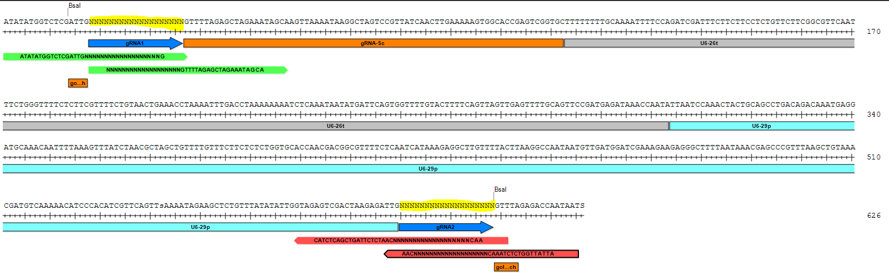

CRISPR-Cas9 editing
===

# Material required


## Plasmids

The construct is split into one module vector set (pCBC-DT1T2) contaning the guide RNAs (gRNAs) and a binary vector based on pCAMBIA (pHHE401E). The cloning is based on a primary PCR to add the proper target sequences on the gRNA on the module vector, *BsaI* restriction sites are used to ligate the module vector set to the binary vector and remove meanwhile its spectinomycin (SpR) resistance cassette.

*Cas9* expression is driven by the promoter of the egg cell-specific *EC1.1* ([AT1G76750](https://www.arabidopsis.org/servlets/TairObject?id=29908&type=locus)) gene and the enhancer  *EC1.2* gene ([AT2G21740](https://www.arabidopsis.org/servlets/TairObject?accession=locus:2052536)). See [Wang et al. 2015](https://genomebiology.biomedcentral.com/articles/10.1186/s13059-015-0715-0) called *EASE*. This tissue-specific expression of *Cas9* allows to obtain T1 homozygous or biallelic plants instead of mosaic plants. The terminator of the *Pisum sativum rbcS E9* gene was tested according to previous observation ([Sarrion-Perdigones et al 2013](http://www.plantphysiol.org/content/162/3/1618.short)) and found more efficient than coupled with a NOS terminator (Wang et al 2015).


### Module vector pCBC-DT1T2

More information on https://www.addgene.org/50590/ derived from paper [Xing et al 2014](https://bmcplantbiol.biomedcentral.com/articles/10.1186/s12870-014-0327-y)

This vector contains 2 single guide RNAs (sgRNAs) with each a target site (highlighted in yellow in image below). More targets can be added by adding primers with specific overhanging sequence for Golden Gate assembly. See more details about Golden Gate assembly on [NEB website](https://international.neb.com/applications/cloning-and-synthetic-biology/dna-assembly-and-cloning/golden-gate-assembly).

The main principle to understand is that a type IIS restriction enzyme such as *BsaI*, used here, is able to cut besides its actual recognition site, allowing to create non-palindromic overhangs which allow directional cloning.

*BsaI* restriction site:

```
5'...GGTCTC(N)1...3'
3'...CCAGAG(N)5...5'
```

The enzyme cuts 1 nucleotide directly upstream of the recognition side on the + strand but 5 nucleotides upstream on the - strand. The 5 nucleotides overhang can be chosen and included in any construct to allow ligation. T4 ligase is used to ligate the corresponding cohesive ends (it is also able to ligate blunt ends but with much lower efficiency).


 

The 2 most outward primers indicated in red and blue allow to add specific overhanging sites matching to BsaI sites in the pHHE401E binary vector and allow directional cloning. The second 2 primers more inward contain a part of the vector pCBC-DT1T2. All primers contain their respective target sites (highlighted in yellow). This target site should be 20 bp long be adjacent to a NGG site (N being any nucleotide), which is not in the primer sequence. This site is called the protospacer adjacent motif (PAM). Cas9 enzymes cuts theoretically 3 bp upstream of the PAM motif (always within the target region).

For instance for the sequence `TATTTCGGG`, the kmer `GGG` is the PAM motif and the cut will therefore take place here: `TATT|TTCGGG`

Note that the vector does not contain the promoter of the first sgRNA and the second sgRNA does not contain either its scaffolding RNA part nor its terminator. These sequences are actually in the pHHE401E binary vector and will be integrated in place after the digestion with *BsaI* enzyme.


### pHHE401E binary vector

More information on https://www.addgene.org/71287/ 
based on pCambia backbone for Agrobacterium-mediated transformation.

## Primers

For each target site