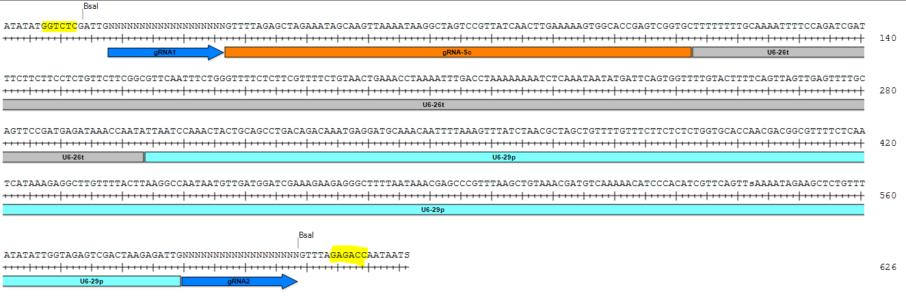
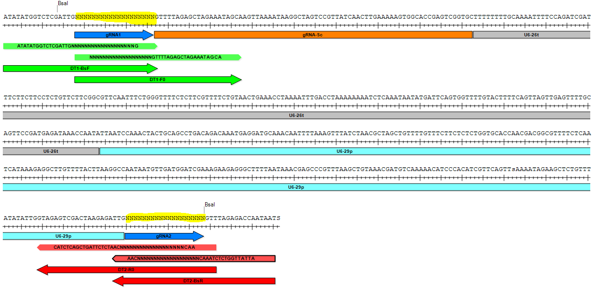
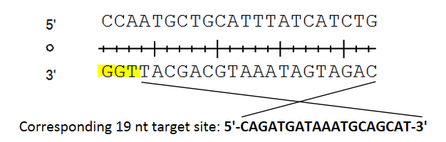
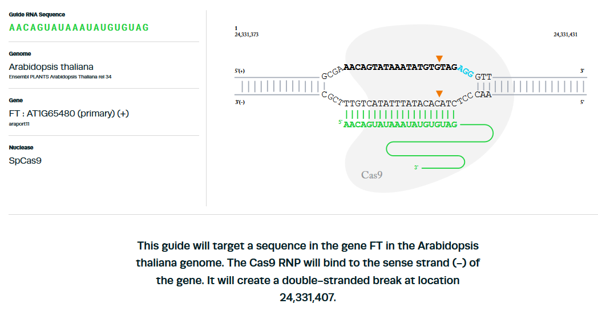
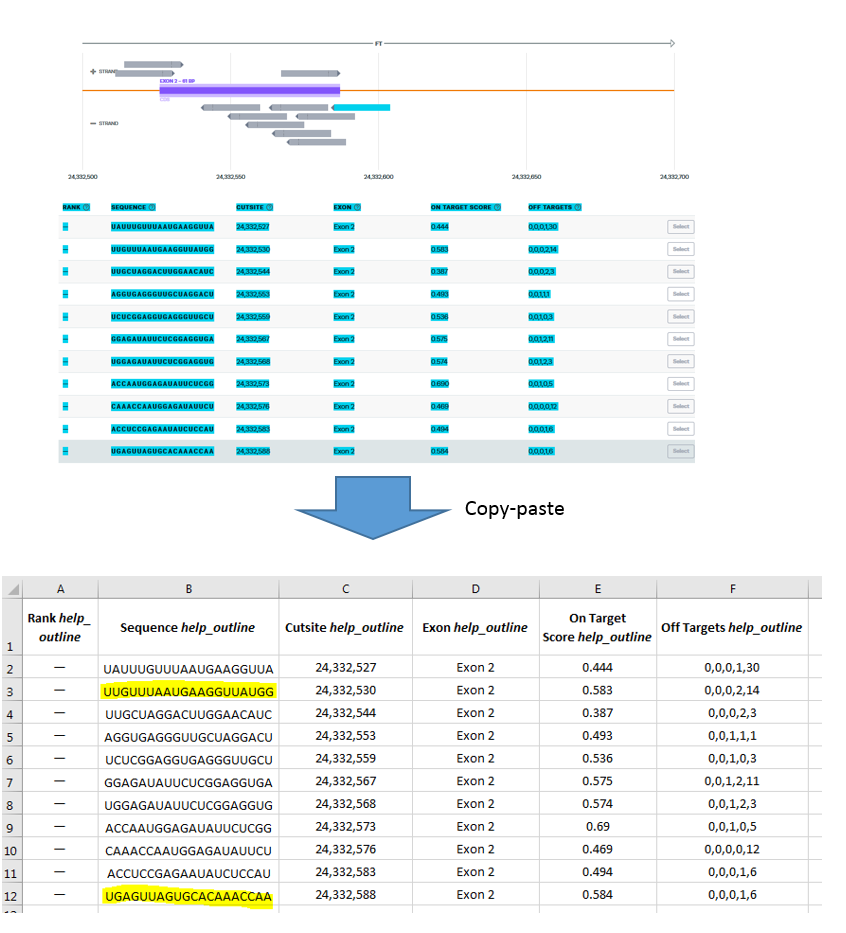

CRISPR-Cas9 editing
===


# Table of contents

- [CRISPR-Cas9 editing](#crispr-cas9-editing)
- [Table of contents](#table-of-contents)
- [Material required](#material-required)
  * [Plasmids](#plasmids)
    + [Module vector pCBC-DT1T2](#module-vector-pcbc-dt1t2)
    + [pHHE401E binary vector](#phhe401e-binary-vector)
  * [sgRNAs](#sgrnas)
    + [Cloning strategy](#cloning-strategy)
    + [Select target sites with Synthego](#select-target-sites-with-synthego)
      - [1. Select genome and gene to knockout on this [page](https://design.synthego.com/#/)](#1-select-genome-and-gene-to-knockout-on-this--page--https---designsynthegocom----)
      - [2. Select the exon to target and copy paste the information of the recommended or/and additional guides on a spreadsheet program (Excel or Libre Office). One can select manually which guide to select for the cloning.](#2-select-the-exon-to-target-and-copy-paste-the-information-of-the-recommended-or-and-additional-guides-on-a-spreadsheet-program--excel-or-libre-office--one-can-select-manually-which-guide-to-select-for-the-cloning)
      - [3. Transfer data on Spreadsheet and select target sites](#3-transfer-data-on-spreadsheet-and-select-target-sites)
      - [4. Design primers](#4-design-primers)
- [GoldenGate cloning](#goldengate-cloning)
- [Transformation and selection in E. coli](#transformation-and-selection-in-e-coli)
- [Transformation and selection in A. tumefaciens](#transformation-and-selection-in-a-tumefaciens)
- [Agrobacterium-mediated transformation of Arabidopsis](#agrobacterium-mediated-transformation-of-arabidopsis)
- [T1 selection](#t1-selection)
- [Authors:](#authors-)

<small><i><a href='http://ecotrust-canada.github.io/markdown-toc/'>Table of contents generated with markdown-toc</a></i></small>


# Material required


## Plasmids

The construct is split into one module vector set (pCBC-DT1T2) contaning the guide RNAs (gRNAs) and a binary vector based on pCAMBIA (pHHE401E). The cloning is based on a primary PCR to add the proper target sequences on the gRNA on the module vector, *BsaI* restriction sites are used to ligate the module vector set to the binary vector and remove meanwhile its spectinomycin (SpR) resistance cassette [Xing et al 2014](https://bmcplantbiol.biomedcentral.com/articles/10.1186/s12870-014-0327-y).

*Cas9* expression is driven by the promoter of the egg cell-specific *EC1.1* ([AT1G76750](https://www.arabidopsis.org/servlets/TairObject?id=29908&type=locus)) gene and the enhancer  *EC1.2* gene ([AT2G21740](https://www.arabidopsis.org/servlets/TairObject?accession=locus:2052536)). This tissue-specific expression of *Cas9* allows to obtain T1 homozygous or biallelic plants instead of mosaic plants. The terminator of the *Pisum sativum rbcS E9* gene was tested according to previous observation ([Sarrion-Perdigones et al 2013](http://www.plantphysiol.org/content/162/3/1618.short)) and found more efficient than coupled with a NOS terminator. See reference [Wang et al. 2015](https://genomebiology.biomedcentral.com/articles/10.1186/s13059-015-0715-0).


### Module vector pCBC-DT1T2

More information on https://www.addgene.org/50590/

This vector contains 2 single guide RNAs (sgRNAs) target sequences (Ns). More targets can be added by adding primers with specific overhanging sequence for Golden Gate assembly. See more details about Golden Gate assembly on [NEB website](https://international.neb.com/applications/cloning-and-synthetic-biology/dna-assembly-and-cloning/golden-gate-assembly).

The main principle to understand is that a type IIS restriction enzyme such as *BsaI*, used here, is able to cut besides its actual recognition site, allowing to create non-palindromic overhangs which allow directional cloning.

*BsaI* restriction site:

```
5'...GGTCTC(N)1...3'
3'...CCAGAG(N)5...5'
```

The enzyme cuts 1 nucleotide directly upstream of the recognition side on the + strand but 5 nucleotides upstream on the - strand (highlighted in yellow in figure below). The 5 nucleotides overhang can be chosen and included in any construct to allow ligation. T4 ligase is used to ligate the corresponding cohesive ends (it is also able to ligate blunt ends but with much lower efficiency).


 
*Part of the plasmid pCBC-DT1T2 containing the elements which will be transfered into pHHE401E during the GoldenGate cloning. BsaI restriction sites are highlighted in yellow.*

Note that the vector pCBC-DT1T2 does not contain the promoter of the first sgRNA and the second sgRNA contains neither its scaffolding RNA part nor its terminator. These sequences are actually in the pHHE401E binary vector and will be integrated in place after the digestion with *BsaI* enzyme and the ligation (GoldenGate cloning).


### pHHE401E binary vector

pHHE401E is based on pCambia backbone for Agrobacterium-mediated transformation. It contains the complementary parts of the pCBC-DT1T2 which ensures the proper expression of the 2 sgRNAs plus other features needed for Agrobacterium transformation and selection.

More information on https://www.addgene.org/71287/ 

## sgRNAs

### Cloning strategy

The vector pCBC-DT1T2 can contain two target sites. These should be no more than 100 bp apart in the genome.
To generate 2 sgRNAs with each their target site (gRNA1 and gRNA2 indicated by blue arrows and highlighted in yellow in image below), 4 primers need to be designed. Two primers for the target site 1 and 2 primers for the target size 2 (see image below):

First sgRNA (green on picture below)

* DT1-BsF
* DT1-F0

Second sgRNA (red on picture below)

* DT2-BsR
* DT2-R0

These target sites should be 19 bp long be adjacent to a NGG site (N being any nucleotide), which is not in the primer sequence. This site is called the protospacer adjacent motif (PAM). Cas9 enzymes cuts theoretically 3 bp upstream of the PAM motif (always within the target region). The target sites are represented by Ns in the figure below. The PAM should always be originally located at the 5' end of the sgRNA target sequence (highlighted in yellow). 

For instance for the sequence `TCGAGAGAGAGCGTATTTCGGG`, the kmer `GGG` is the PAM motif located 5' of the sequence and the cut will therefore take place here: `TCGAGAGAGAGCGTATT|TTCGGG`. The sequence to include in the 2 primers will be therefore the 19-mer `TCGAGAGAGAGCGTATTTTC` (note the PAM is not included).


*Part of the plasmid pCBC-DT1T2 containing the elements which will be transfered into pHHE401E during the GoldenGate cloning. Target sites are highlighted in yellow.*

The 2 most outward primers indicated in red (DT1-BsF) and red (DT2-BsR) allow to add specific overhanging sites including a specific BsaI site and its corresponding overhang sequence present in the pHHE401E binary vector and allow directional cloning. The second 2 primers more inward (DT1-F0 and DT2-R0) contain a part of the vector pCBC-DT1T2. All primers contain their respective target sites (Ns). The PCR with all primers allow therefore to add in a first step the target sites with the primers DT1-F0 and DT2-R0 and in a second step the BsaI restriction site for GoldenGate cloning (DT1-BsF and DT2-BsR).

Both should contain the 19 bp of the target site (highlighted in yellow) plus flanking regions that are either used for Gateway cloning or for the merging to the vector pCBC-DT1T2.


**Note**: If the PAM is located on the reverse strand, the sequence used in the primer represents the reverse complement sequence of the + strand. See example below. Note that the PAM should always be in 5' position of the target site in the pCBC-DT1T2 plasmid.

 
 
 *Representation of a target site plus its PAM motif (highlighted in yellow) when located on reverse strand. The PAM is NEVER contained in the final primer sequence.*
 
### Select target sites with Synthego

One can identify a cleavage site manually by looking at available PAM motifs, however using dedicated tools allow to identify these sites automatically and attribute them a score according to the likelihood to get an off-target and the potential efficiency of the Cas9 on the target sequence itself. The tool utilized here is the web-based tool for guide design by [Synthego](https://design.synthego.com/#/). It works for Arabidopsis and many other plant and animal species.

In this example, we want to knockout *FLOWERING LOCUS T* (AT1G65480) by targeting the exon 2.

**1. Select genome and gene to knockout on this [page](https://design.synthego.com/#/)**


**2. Select the exon to target**

The software will be default show target sites for exon 1 (or exon 2 if the exon 1 contains only UTR) as it is the most likely place to knockout the gene. However, one can change the target exon (highlighted in yellow in image below) but no green target sites (recommended) will appear. This can be required in some cases, e.g. assess the effect of a natural mutation which induces a premature stop codon in the exon 2.


By clicking on one of the target site in the bottom table, a new window appears and display how Cas9 and the scaffold RNA bind to the sequence and where the enzyme cut. Very useful to understand how it works.

**Example:**




**3. Transfer data on Spreadsheet and select target sites**

Select the exon to target (in that case, I change to exon 2) and then copy-paste the information of the recommended or/and additional guides into a spreadsheet program (Excel or Libre Office). One can select manually which guide to select for the cloning.



I selected 2 target sites (highlighted in yellow above) which indicate high on-target values and a low off-target values. The cut sites are separated by 58 bp (24,332,588-24,332,530) which is below the 100 bp recommended threshold
.
Note: The on-target ranking is based on the Rule Set 2 model (see publication [Doench et al., 2016](https://www.nature.com/articles/nbt.3437) for more details). Since this method was developed on animal cells, I am not sure whether it really applies to Arabidopsis but since the same Cas9 enzyme is used, I assume it may not be dependent on the genome.

**4. Design primers**

Since the output of Synthego is giving per default 20 bp-long target sites and we want 19 bp-long target sites for our construct (I assume it should also work with 20 bp but we stick here to the published protocol [Wang et al. 2015](https://genomebiology.biomedcentral.com/articles/10.1186/s13059-015-0715-0). We need to remove the first nucleotide and convert the U into Ts. This can be done easily in the terminal:

* Paste the 2 sequences of interest in a text file `sgRNAs.txt`

```
UUGUUUAAUGAAGGUUAUGG
UGAGUUAGUGCACAAACCAA
```

* Convert Windows to unix EOLs

```
vim sgRNAs.txt -c ":set ff=unix" -c ":wq"
```

* Remove the first character of each line (1st nucleotide in 5')

```
sed -i 's/^.//g' sgRNAs.txt
```

* Replace U by Ts

```
sed -i 's/U/T/g' sgRNAs.txt
```

The final target sites are now 19 nuclotides:

```
cat sgRNAs.txt
TGTTTAATGAAGGTTATGG
GAGTTAGTGCACAAACCAA
```

**Note**: Since the nucleotides are now 19 bp instead of 20 bp, the off-target score may have changed!

* Generate primer sequences for GoldenGate cloning

```
python /primer_modifier.py sgRNAs.txt

Target sequence 1: tgtttaatgaaggttatgg
DT1_BsF: ATATATGGTCTCGATTGtgtttaatgaaggttatggG
DT1_F0: tgtttaatgaaggttatggGTTTTAGAGCTAGAAATAGCA
DT2_BsR: ATTATTGGTCTCTAAACtgtttaatgaaggttatggCAA
DT2_R0: AACtgtttaatgaaggttatggCAATCTCTTAGTCGACTCTAC


Target sequence 2: gagttagtgcacaaaccaa
DT1_BsF: ATATATGGTCTCGATTGgagttagtgcacaaaccaaG
DT1_F0: gagttagtgcacaaaccaaGTTTTAGAGCTAGAAATAGCA
DT2_BsR: ATTATTGGTCTCTAAACgagttagtgcacaaaccaaCAA
DT2_R0: AACgagttagtgcacaaaccaaCAATCTCTTAGTCGACTCTAC

```

This generates for each target site the primers for both sgRNAs (target sequence in lowercase). The user decides then to which sgRNA each target sequence goes. For instance, I will put the target site `tgtttaatgaaggttatgg` in the first sgRNA and the target site `gagttagtgcacaaaccaa` in the second. I therefore need to order the following primers:

```
DT1_BsF: ATATATGGTCTCGATTGtgtttaatgaaggttatggG
DT1_F0: tgtttaatgaaggttatggGTTTTAGAGCTAGAAATAGCA
DT2_BsR: ATTATTGGTCTCTAAACgagttagtgcacaaaccaaCAA
DT2_R0: AACgagttagtgcacaaaccaaCAATCTCTTAGTCGACTCTAC
```

These primers would fit on the pCBC plasmid as indicated below (lowercase nucleotides indicate target sites)


*Part of the plasmid pCBC-DT1T2 containing the elements which will be transfered into pHHE401E during the GoldenGate cloning. Chosen target site sequences are indicted in lower capital in the different primers.*

Note: the GoldenGate reaction is usually working straight away but the user can order additional primers for other cutting sites. In this case, select at step 3 additional target sites and generate the primer sequence for sgRNA1 and sgRNA2 as explained above.


# GoldenGate cloning


# Transformation and selection in E. coli


# Transformation and selection in A. tumefaciens


# Agrobacterium-mediated transformation of Arabidopsis


# T1 selection


# Authors

* [Johan Zicola](https://github.com/johanzi)

* [Emmanuel Tergemina](https://github.com/EmmanuelTergemina)
