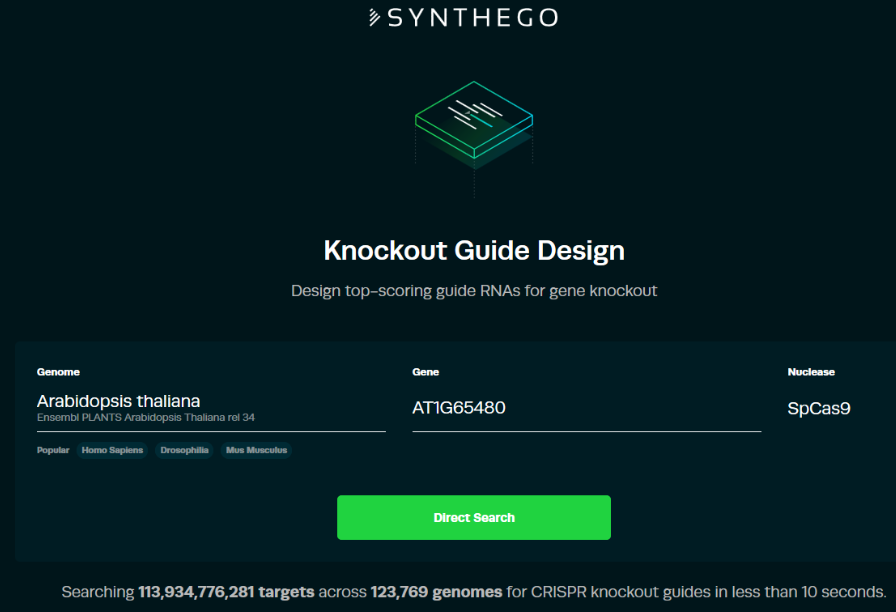

Define target sites with Synthego
===

In this example, we want to knockout *FLOWERING LOCUS T* (AT1G65480) by targeting the exon 2.

**1. Select genome and gene to knockout on this [page](https://design.synthego.com/#/)**

**Note:** The genome assembly used by Synthego (on 2018-01-08) for *Arabidopsis thaliana* is the ENSEMBL release 34 based on TAIR10 assembly (December 2016). Therefore, the new annotations from [Araport11](https://www.araport.org/data/araport11) assembly is not in there. This can be a problem for certain genes which have been reannotated. The size of the chromosomes remain unchanged between TAIR10 and Araport11. Check Araport11 latest annotation on `Araport11_GFF3_genes_transposons.201606.gff.gz` file which can be downloaded [here](https://www.araport.org/downloads/Araport11_latest/annotation) (note that one needs to register first to download data, it is free). Also, if one needs to transform another accession than the reference Col-0, the single nucleotide polymorphisms should be consider when designing the sgRNAs. The appropriate sequence can be downloaded on [1001genomes.org](http://tools.1001genomes.org/pseudogenomes/#select_strains) if the accession is part of the project. One can also generate a pseudogenome from a VCF file using the following [pipeline](https://github.com/johanzi/make_pseudogenome). Then the pseudogenome sequence of the gene of interest can be used as input 

**2. Select the exon to target**

The software will be default show target sites for exon 1 (or exon 2 if the exon 1 contains only UTR) as it is the most likely place to knockout the gene. However, one can change the target exon (highlighted in yellow in image below) but no green target sites (recommended) will appear. Selecting a specific exon can be required in some cases, e.g. to assess the effect of a natural mutation which induces a premature stop codon in exon 2.

By clicking on one of the target site in the bottom table, a new window appears and display how Cas9 and the scaffold RNA bind to the sequence and where the enzyme cut. This is very useful to understand how it works.

**Example:**

**3. Transfer data on Spreadsheet and select target sites**

Select the exon to target (in that case, I change to exon 2) and then copy-paste the information of the recommended or/and additional guides into a spreadsheet program (Excel or Libre Office). One can select manually which guide to select for the cloning.

I selected 2 target sites (highlighted in yellow above) which indicate high on-target values and a low off-target values. The cut sites are separated by 58 bp (24,332,588-24,332,530) which is below the 100 bp recommended threshold
.
Note: The on-target ranking is based on the Rule Set 2 model (see publication [Doench et al., 2016](https://www.nature.com/articles/nbt.3437) for more details). Since this method was developed on animal cells, I am not sure whether it really applies to Arabidopsis but since the same Cas9 enzyme is used, I assume it may not be dependent on the genome.